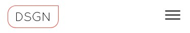
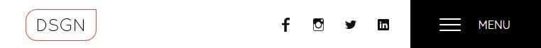
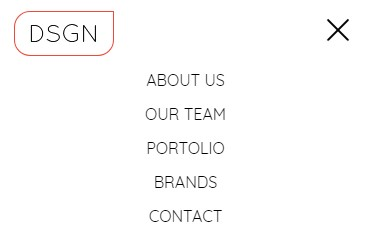
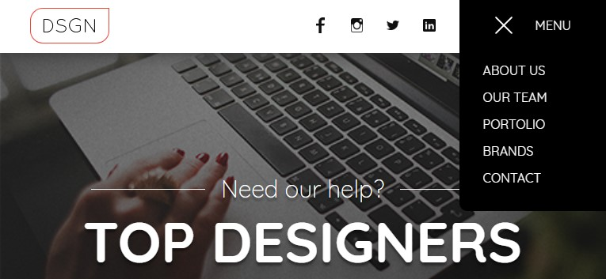
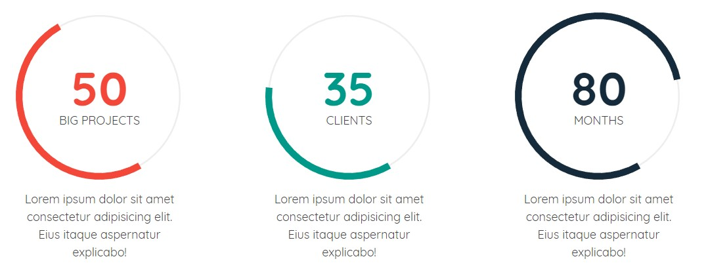
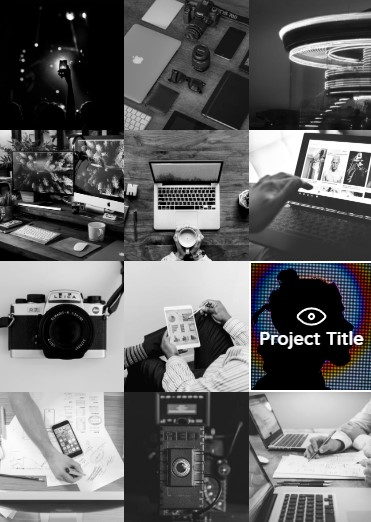
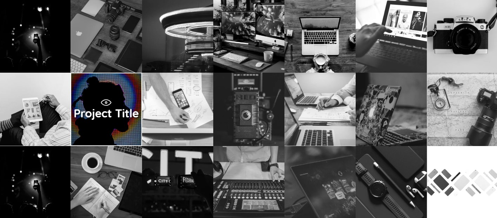
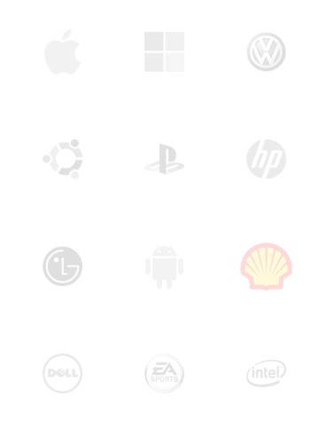
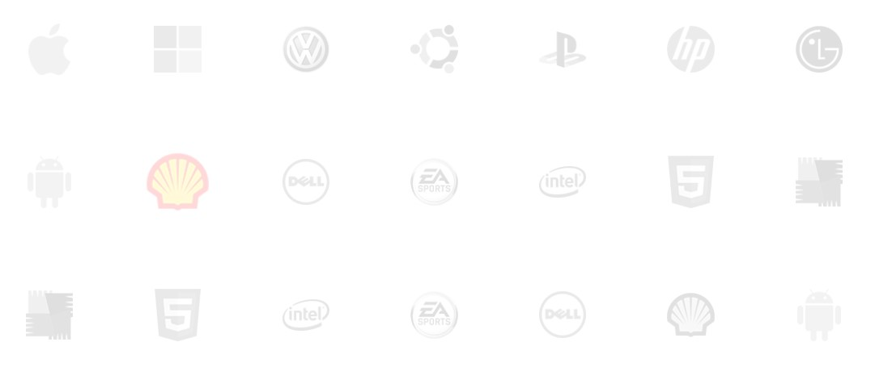

# Weekly WebDev Challange #8 - TOP DESIGNERS

This is a training project developed to improve my front-end programming skills within HTML, CSS, JS and the _React_ framework. The design was provided by the _Facebook_ group _[Weekly WebDev Challange](https://www.facebook.com/groups/940002776068923/)_ and to them are the thanks due.

## Getting started

These instructions will get you a copy of the project up and running on your local machine for the development and testing purposes.

### Prerequisites

Things you need to install the software:

- Node JS
- npm

### Running the project

This project is based on the _create-react-app_ boilerplate by _Facebook_ and has the built-in dev server. To get it running, type the following commands:

```
yarn
yarn start
```

If you are more interested in getting the compiled production build, please type:

```
yarn
yarn build
```

---

Alternatively, you can use the `npm run` command instead of `yarn`.

## Main features

### Responsive header/navbar

|                                       Mobile                                        |                                        Desktop                                        |
| :---------------------------------------------------------------------------------: | :-----------------------------------------------------------------------------------: |
|  |  |

### Expandable/collapsible header/navbar menu

|                                                     Mobile                                                      |                                                      Desktop                                                      |
| :-------------------------------------------------------------------------------------------------------------: | :---------------------------------------------------------------------------------------------------------------: |
|  |  |

### Animated JS progress circles &copy; ProgressBar.js



### Advanced RWD within the _Our Team_ section's subcomponents

|                                          Mobile                                          |                                          Desktop                                           |
| :--------------------------------------------------------------------------------------: | :----------------------------------------------------------------------------------------: |
|  |  |

### Subtle hover effects over the _Portolio_ section's grid items

|                                     Mobile                                     |                                     Desktop                                      |
| :----------------------------------------------------------------------------: | :------------------------------------------------------------------------------: |
|  |  |

### Subtle hover effects over the _Brands_ section's grid items

|                                  Mobile                                  |                                  Desktop                                   |
| :----------------------------------------------------------------------: | :------------------------------------------------------------------------: |
|  |  |

## Built with

- [React](https://reactjs.org/) - The _Facebook's_ front-end framework for the modern web.
- [ProgressBar.js](https://kimmobrunfeldt.github.io/progressbar.js/) - JavaScript library that helps with the creation of the responsive and stylish progress bars for the web.
- [CSS Hamburgers](https://jonsuh.com/hamburgers/) - The simple CSS-generated hamburger buttons.
- [create-react-app](https://github.com/facebook/create-react-app) - The _Facebook's_ powerful _React_ boilerplate.
- [Photopea](https://www.photopea.com/) - The web-based alternative for the _Adobe Photoshop_.

## Authors

- Stanisław Gregor ([staszek998](https://github.com/staszek998)) - _Development_
- [Weekly WebDev Challange](https://www.facebook.com/groups/940002776068923/) - _Design_

## License

This project is licensed under the MIT License.
